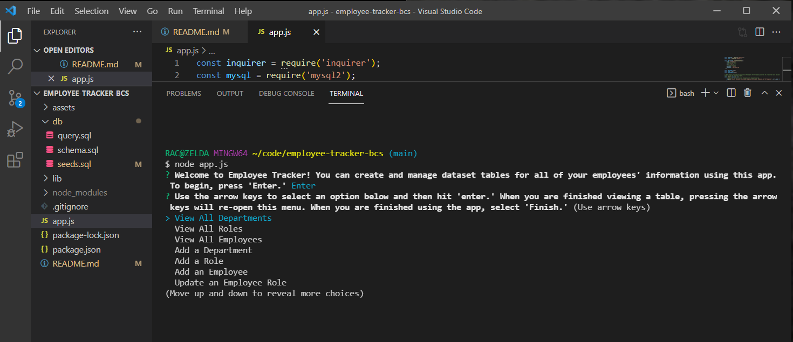
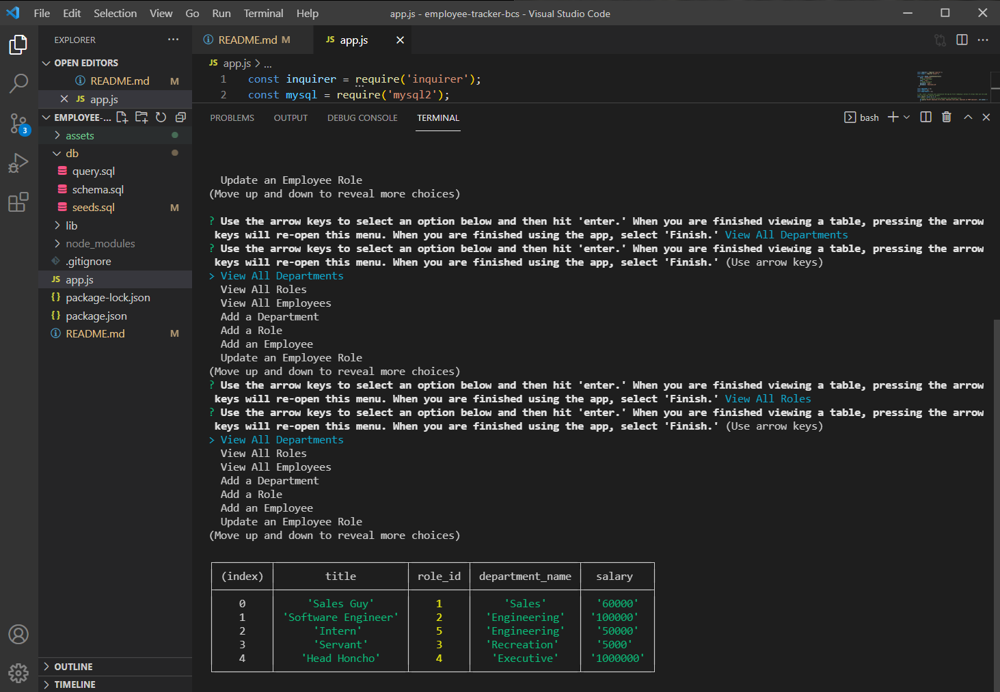
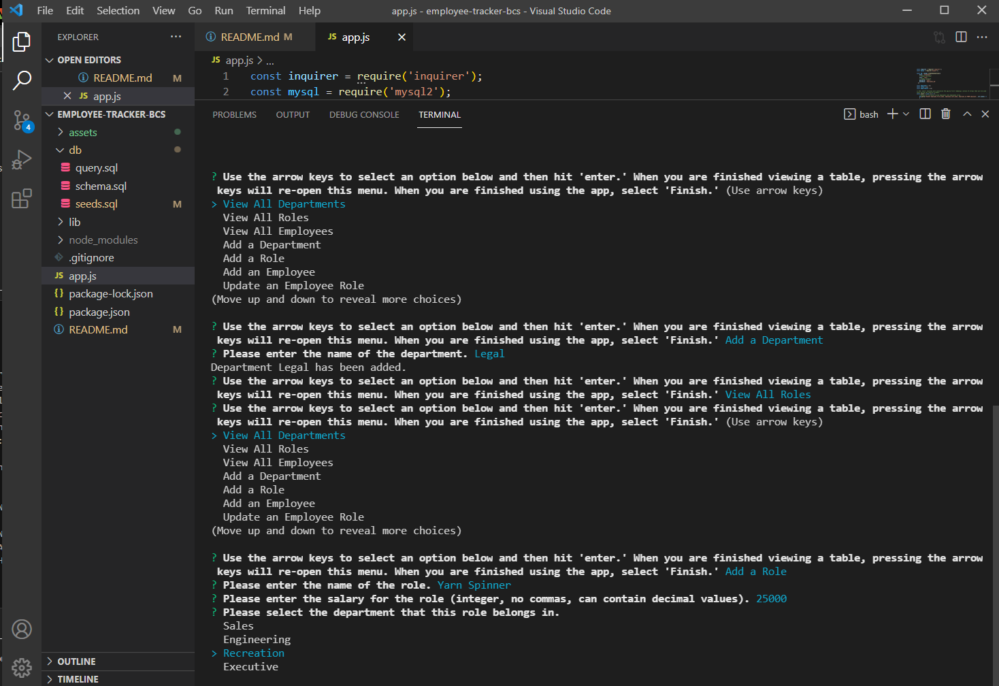

# employee-tracker-bcs

## Description

Ever wanted a tool to help you organize your company and its swath of employees? Ever wanted to consolidate team information without having to laboriously trudge through Excel, filling out each cell one-by-one? Then you are in luck, for the employee-tracker app that I have developed will allow you to avoid these hassles by generating these tables for you! Using the inquirer module, you will be walked through a series of prompts that take your inputs and render them into various pre-structured datasets. You may add to these datasets as much as you desire, and your inputs will save so that you may return to the app whenever you need it. I've learned much about the power of mysql and database applications in general by creating this app and am excited to integrate it with other skills I've acquired thus far, beyond the command line.

## Table of Contents

- [Installation](#installation)
- [Usage](#usage)
- [Credits](#credits)
- [License](#license)

## Installation

This is a command-line app, so there are some installation steps required before you can use it. 
1. Clone this repository.
2. Install the dependencies listed in the package.json by typing 'npm i' in the terminal.
3. Initialize the app by typing 'node app.js' in the terminal.
4. Log in to mysql and then run the schema.sql by typing 'source db/schema.sql'
5. (Optional) Seed the newly created datasets by typing 'source db/seeds.sql' if you want to experiment with how the app functions before adding any of your own data.
6. If you wish to clear the dataset entirely, just rune 'source db/schema.sql' again.

I've also uploaded a video walkthrough on how to install the app and how the app works. You can watch it here: [https://www.youtube.com/watch?v=oIqtvuLh26s]

## Usage

The app runs in the command line. Once you run 'node app.js' the app should appear in the terminal. Use the arrow keys and the enter button to make your selections therefrom.

The user is able to add departments, roles and employees. As many of these can be added as desired. They can also view said departments, roles and employees by selecting the appropriate view option from the main menu. 

When the user is finished, they should hit 'Finish' on the main menu to exit the app.

## Credits

Inquirer: [https://www.npmjs.com/package/inquirer]

MySQL: [https://www.npmjs.com/package/mysql]

## License
MIT License

Copyright (c) [2022] [shnala]

Permission is hereby granted, free of charge, to any person obtaining a copy
of this software and associated documentation files (the "Software"), to deal
in the Software without restriction, including without limitation the rights
to use, copy, modify, merge, publish, distribute, sublicense, and/or sell
copies of the Software, and to permit persons to whom the Software is
furnished to do so, subject to the following conditions:

The above copyright notice and this permission notice shall be included in all
copies or substantial portions of the Software.

THE SOFTWARE IS PROVIDED "AS IS", WITHOUT WARRANTY OF ANY KIND, EXPRESS OR
IMPLIED, INCLUDING BUT NOT LIMITED TO THE WARRANTIES OF MERCHANTABILITY,
FITNESS FOR A PARTICULAR PURPOSE AND NONINFRINGEMENT. IN NO EVENT SHALL THE
AUTHORS OR COPYRIGHT HOLDERS BE LIABLE FOR ANY CLAIM, DAMAGES OR OTHER
LIABILITY, WHETHER IN AN ACTION OF CONTRACT, TORT OR OTHERWISE, ARISING FROM,
OUT OF OR IN CONNECTION WITH THE SOFTWARE OR THE USE OR OTHER DEALINGS IN THE
SOFTWARE.
